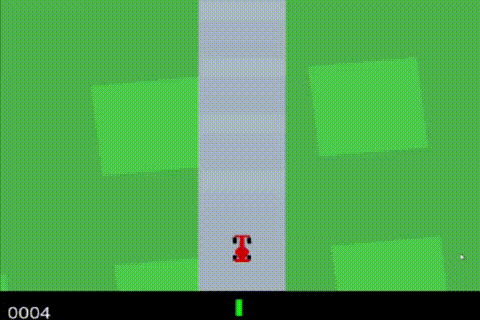

# CarRacing-PolicyGradient
A well-commented application of Monte Carlo Policy Gradient on OpenAI Gym CarRacing-v0 environment.

I tried to put as many comments as possible. I hope this code can be useful for those struggling with Policy Gradients or Reinforcement Learning in general.

This environment is pretty tricky when compared to other OpenAI envs. Making an AI that actually works was challenging for me. I went through a lot of trial and error to improve this algorithm.

Just a reminder: The Policy Gradient method has very high variance. Sometimes you will get lucky and converge into a decent model in less than 20 episodes. Other times you might run 1000 episodes and still get stuck at the start of the tracks.

## How it Works
  
  - simple.py: Simple version. 
  - improved.py: Improved version. Uses color channels and some other strategies
  - experimental.py: Experimental version. Used to test new ideas that can improve the AI. May not have as many comments as the other versions.
  - watch.py: Use this file to watch the model play. Don't forget to change the model location.
  

## Videos

First episode

After some training

Recommended article: https://github.com/simoninithomas/Deep_reinforcement_learning_Course.
